# Marketplace Dispute Resolution Copilot

> Project 2 in my GitHub product portfolio, focused on human-in-the-loop AI workflow automation for marketplace dispute resolution.

This project explores how AI-enabled workflow automation can support support agents and trust & safety reviewers in resolving buyer-seller disputes with incomplete, conflicting, or ambiguous evidence.

## Problem Statement

Marketplace dispute resolution is operationally complex because support agents often need to make decisions using incomplete, contradictory, or fragmented evidence.

A single dispute may require reviewing buyer claims, seller responses, delivery events, order value, buyer history, seller history, marketplace policy, and prior case context.

Poor dispute handling can create inconsistent decisions, unnecessary refund leakage, unfair seller outcomes, poor buyer experience, SLA breaches, and weak auditability.

## Product Goal

The goal of this project is to design a human-in-the-loop dispute workflow system that helps reviewers investigate and resolve buyer-seller disputes more consistently.

The system uses AI to reduce reviewer cognitive load, but deterministic policy rules, workflow state transitions, reviewer rationale, and audit logging govern final actions.

The goal is not to automate final dispute decisions.

## Product Principle

> **Automate preparation, not accountability.**

AI can help prepare a dispute case for review, but final outcomes require deterministic validation, reviewer rationale, and audit logging.

## Target Users

### Support Reviewer

Reviews standard buyer-seller disputes, checks evidence, validates recommended next actions, and submits outcomes such as refund, denial, escalation, or request for more evidence.

### Senior Reviewer

Handles escalated or ambiguous cases involving high-value orders, buyer risk signals, contradictory evidence, or special policy exceptions.

### Operations Manager

Needs visibility into case status, escalation volume, decision consistency, SLA risk, override patterns, and audit history.


## Key Features

- **Dispute queue:** Displays synthetic marketplace dispute cases with claim type, status, order value, buyer risk, seller response, delivery status, recommended action, and escalation requirement.
- **Case detail view:** Shows structured order, buyer, seller, claim, and delivery evidence for reviewer inspection.
- **Deterministic policy evaluation:** Evaluates eligible actions, blocked actions, required evidence, ambiguity flags, risk flags, escalation requirements, and policy rationale.
- **Workflow state machine:** Controls valid dispute lifecycle transitions such as `ready_for_review`, `policy_evaluated`, `agent_review`, `evidence_pending`, `escalated`, and resolved states.
- **Reviewer action validation:** Validates proposed reviewer actions against workflow state, policy constraints, and rationale requirements before allowing submission.
- **SQLite persistence:** Persists case status locally so workflow state changes survive app refreshes.
- **Audit trail:** Records seeded cases, investigations, reviewer actions, status transitions, rationale, and validation context.
- **Bounded AI investigation agent:** Uses OpenAI to summarize evidence, identify contradictions, highlight missing evidence, and prepare reviewer briefs within deterministic boundaries.
- **Deterministic fallback investigation:** Generates a rule-based reviewer brief when OpenAI is unavailable or intentionally degraded.
- **Service degradation controls:** Provides Streamlit sidebar controls to switch AI investigation between `healthy` and `degraded` modes for demo and resilience testing.


## System Architecture

```text
Streamlit UI
   ↓
Reviewer Workflow Layer
   ├── Reviewer Action Validation
   ├── Workflow State Machine
   └── Action Submission Service
   ↓
Deterministic Governance Layer
   ├── Policy Engine
   ├── Eligible / Blocked Actions
   ├── Escalation Rules
   └── Evidence Requirements
   ↓
AI Assistance Layer
   ├── Bounded Investigation Agent
   ├── OpenAI Investigation
   └── Deterministic Fallback Brief
   ↓
Persistence and Audit Layer
   ├── SQLite Case Store
   └── Audit Event Store
```

```markdown
The architecture intentionally separates AI assistance from deterministic control. AI can summarize evidence and prepare reviewer briefs, but policy enforcement, workflow transitions, final action validation, and audit logging are handled by deterministic services.
```

## AI vs Deterministic Logic

| Responsibility | AI Investigation Agent | Deterministic System |
|---|---:|---:|
| Summarize buyer/seller evidence | Yes | No |
| Identify contradictions | Yes | Partially |
| Draft reviewer brief | Yes | No |
| Recommend next action | Yes, within boundaries | Validates allowed action space |
| Define eligible actions | No | Yes |
| Block unsafe actions | No | Yes |
| Require escalation | No | Yes |
| Validate workflow transitions | No | Yes |
| Persist case state | No | Yes |
| Create audit events | No | Yes |
| Finalize refund or denial | No | Human reviewer + deterministic validation |

> AI prepares. Deterministic systems govern. Humans decide. Audit records.

## AI-Assisted Investigation

The project includes a bounded investigation agent that prepares dispute cases for human review.

The investigation agent receives deterministic policy outputs before generating its reviewer brief. This means the agent sees:

- eligible actions
- blocked actions
- required evidence
- ambiguity flags
- risk flags
- escalation requirements
- current workflow state
- allowed workflow actions

The agent can summarize evidence, identify contradictions, highlight missing information, and recommend a next action within system boundaries.

It cannot finalize a refund, denial, case closure, or seller compensation. Final outcomes still require reviewer submission, workflow validation, deterministic policy checks, and audit logging.

If the OpenAI API is unavailable or intentionally degraded, the app falls back to a deterministic reviewer brief so the workflow remains usable.

## Case Lifecycle

```text
new
  ↓
ready_for_review
  ↓
policy_evaluated
  ↓
agent_review
  ├── evidence_pending
  ├── escalated
  ├── resolved_refund
  ├── resolved_partial_refund
  └── resolved_denied
        ↓
      closed
        ↑
      reopened
```


Then explain:

```markdown
The state machine prevents invalid workflow transitions. For example, a case cannot move directly from `ready_for_review` to `resolved_refund`. It must first pass through policy evaluation and reviewer validation.
```

## Example Workflow

### High-risk item-not-received dispute

1. Buyer claims the item was not received.
2. Delivery status shows delivered.
3. Proof of delivery is available.
4. Buyer has multiple recent disputes.
5. Order value is high.
6. Policy engine marks the case as requiring escalation.
7. AI investigation agent summarizes the evidence and highlights the risk signals.
8. Reviewer submits escalation with rationale.
9. Case state changes to `escalated`.
10. Audit trail records the reviewer action.
11. Senior reviewer can approve refund, deny claim, request evidence, or apply partial resolution depending on policy constraints.

## Product Walkthrough

### Dispute Queue

The queue gives reviewers an operational view of active disputes, including case status, claim type, buyer risk, seller response, delivery status, recommended action, and escalation requirement.

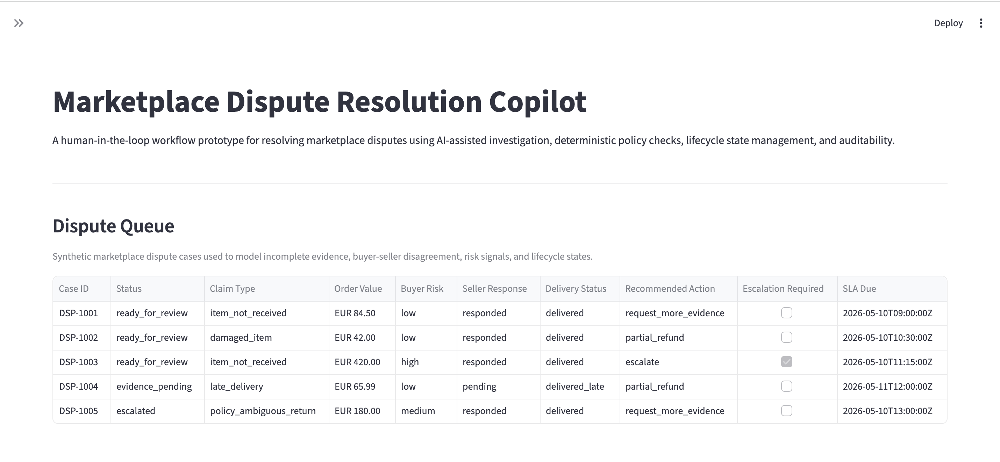

### Deterministic Policy Evaluation

The policy engine evaluates eligible actions, blocked actions, required evidence, ambiguity flags, risk flags, escalation requirements, and policy rationale.

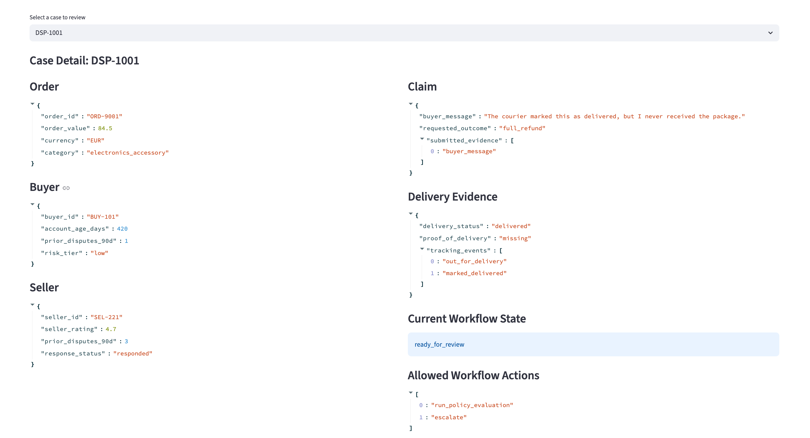
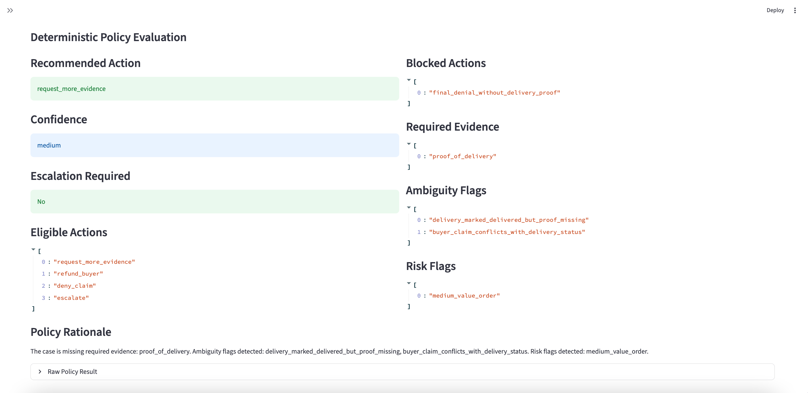

### AI-Assisted Investigation

The bounded investigation agent summarizes evidence, identifies contradictions, highlights missing information, and prepares a reviewer brief within deterministic policy boundaries.

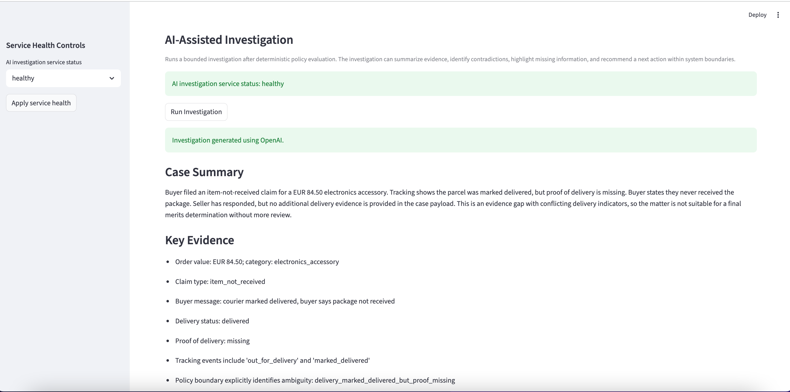
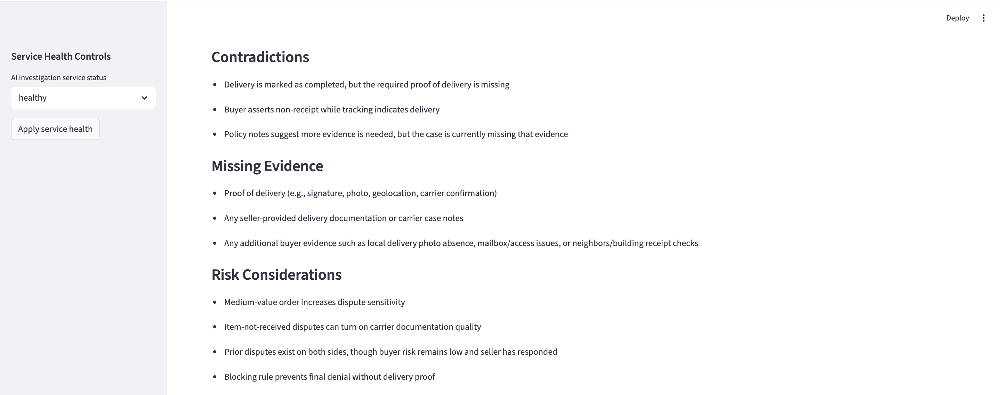
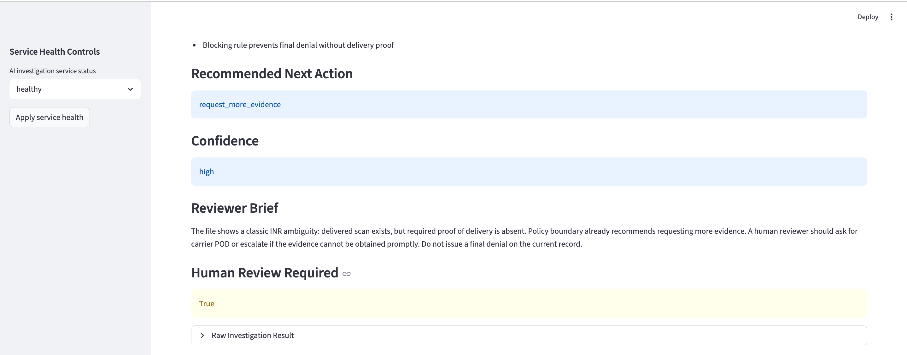

### Degraded AI Mode

When the AI investigation service is degraded, the system skips OpenAI and generates a deterministic fallback reviewer brief so the workflow remains usable.

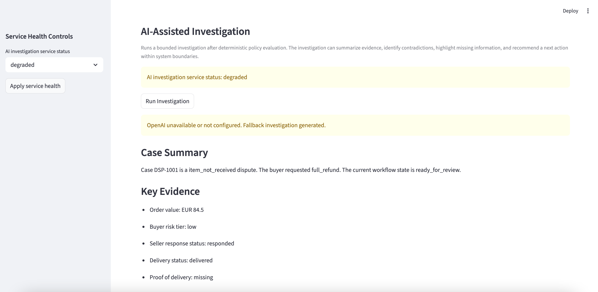
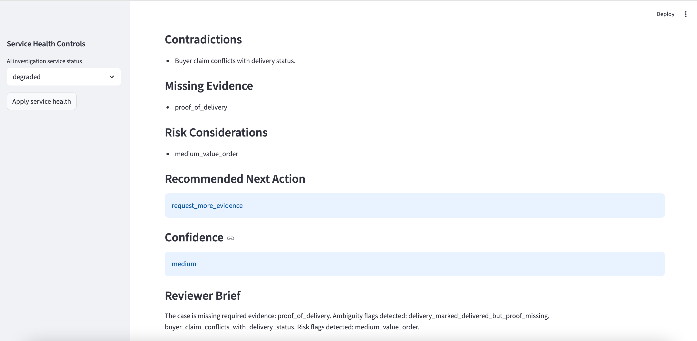
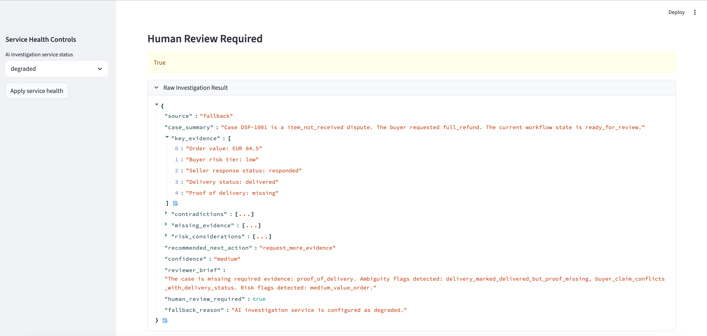

### Reviewer Action Submission

Reviewer actions are validated against workflow state rules, deterministic policy constraints, and rationale requirements before case state is updated.

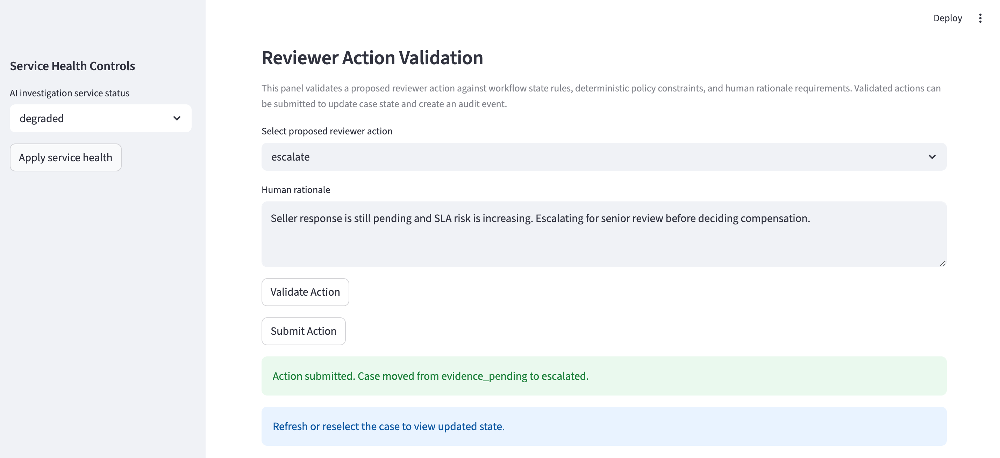

### Audit Trail

The audit trail records seeded cases, investigations, reviewer actions, state transitions, rationale, and validation context.

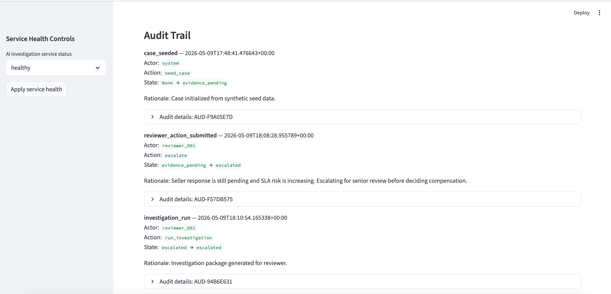

## Service Degradation Handling

The app includes service health controls in the Streamlit sidebar.

The AI investigation service can run in two modes:

- `healthy`: the app attempts to use OpenAI first and falls back only if the API call fails
- `degraded`: the app skips OpenAI and directly generates a deterministic fallback investigation brief

The selected service status is persisted in `data/service_health.json`.

This allows the workflow to remain usable even when the external AI dependency is unavailable, and makes degraded-mode behavior easy to demo from the UI.

## Key Product Decisions

### 1. Automate preparation, not accountability

The system helps reviewers investigate and prepare decisions, but final dispute outcomes require human rationale and deterministic validation.

### 2. Policy before AI recommendation

The policy engine defines the allowed action space before the AI investigation agent recommends a next action. This prevents the AI from suggesting actions that violate marketplace rules.

### 3. SQLite for local workflow persistence

SQLite is used to persist case status and audit events locally. This keeps the prototype easy to run while demonstrating durable workflow state.

### 4. Synthetic data over real dispute data

Real marketplace dispute data is private and sensitive. Synthetic cases allow the prototype to model edge cases such as missing evidence, high-risk buyers, seller non-response, ambiguous policy, and escalated review.

### 5. Degraded AI mode

The app includes service health controls so reviewers can simulate AI service degradation. When degraded, the workflow falls back to a deterministic reviewer brief instead of failing.


## Failure Modes Covered

| Failure Mode | System Behavior |
|---|---|
| OpenAI unavailable | Generate deterministic fallback investigation |
| AI service intentionally degraded | Skip OpenAI and use fallback brief |
| Missing required evidence | Recommend evidence request or escalation |
| High-value/high-risk dispute | Require escalation before final outcome |
| Invalid workflow transition | Block action |
| Reviewer action without rationale | Block submission |
| Policy ambiguous case | Escalate, then unlock senior reviewer resolution paths |
| Case state changes | Persist update and create audit event |

## Success Metrics

### Workflow Metrics

- Average dispute resolution time
- First-touch resolution rate
- Escalation rate
- SLA breach rate
- Reopen / appeal rate

### Quality Metrics

- Reviewer override rate
- Recommendation acceptance rate
- Wrong denial rate
- Refund leakage
- Seller dispute satisfaction
- Buyer dispute satisfaction

### AI Assistance Metrics

- Investigation brief usefulness rating
- Missing evidence detection accuracy
- AI fallback frequency
- Reviewer time saved per case


## How to Run Locally

1. Clone the repository.

```bash
git clone https://github.com/sunny-aryan/marketplace-dispute-resolution-copilot.git
cd marketplace-dispute-resolution-copilot
```

2. Create a virtual environment.

```bash
python3 -m venv .venv
source .venv/bin/activate
```

3. Install dependencies.

```bash
pip install -r requirements.txt
```

4. Create a `.env` file.

```bash
cp .env.example .env
```

Add your OpenAI API key:

```text
OPENAI_API_KEY=your_api_key_here
```

5. Initialize the local SQLite database.

```bash
python scripts/init_db.py
```

6. Run the Streamlit app.

```bash
streamlit run app.py
```

7. Open the local app.
Streamlit will print a local URL in the terminal, usually:

```bash
http://localhost:8501
```

The app uses SQLite for local persistence. The generated database is ignored by Git and can be recreated from `data/seed_cases.json`.

## Trade-offs

This project intentionally prioritizes workflow realism, deterministic controls, and human-in-the-loop decisioning over production infrastructure completeness.

For a detailed explanation of key product and architecture trade-offs, see [TRADEOFFS.md](TRADEOFFS.md).

## Future Improvements

- **Role-based reviewer permissions:** Distinguish between frontline reviewers, senior reviewers, operations managers, and system administrators.
- **Richer appeal and reopen workflow:** Add explicit buyer appeal reasons, new evidence submission, and post-resolution review paths.
- **Reviewer assignment and workload management:** Add queue ownership, priority scoring, SLA sorting, and reviewer assignment.
- **Refund execution boundary:** Add Stripe test-mode integration to model refund execution after human approval and deterministic validation.
- **Delivery evidence provider abstraction:** Add an optional carrier/tracking provider integration while keeping synthetic delivery data for controlled edge cases.
- **Policy versioning:** Store policy version used at the time of evaluation so historical decisions remain auditable after policy changes.
- **Recommendation quality feedback loop:** Allow reviewers to rate investigation usefulness and capture override reasons for future improvement.
- **Operations dashboard:** Add aggregate metrics such as escalation rate, resolution mix, SLA breach risk, AI fallback frequency, and reviewer override rate.
- **Improved UI hierarchy:** Make the Streamlit interface more product-grade with clearer tabs, status badges, and reviewer workflow grouping.
- **Expanded synthetic dataset:** Add more dispute scenarios across item categories, seller behavior patterns, delivery failures, and fraud-risk profiles.